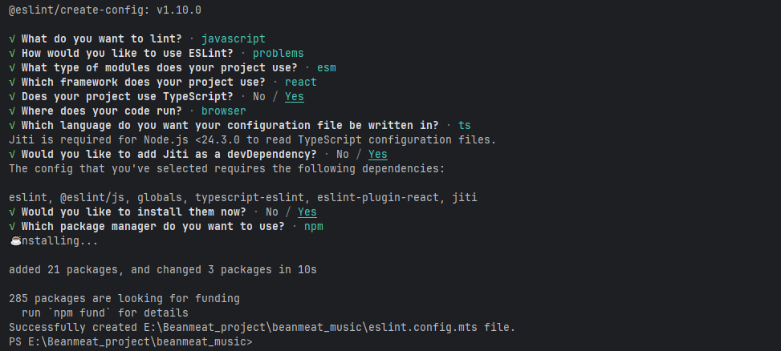

## project init

### create project

创建 `react `项目，并支持 `typescript`

```node
create-react-app beanmeat_music --template typescript
```

### craco

安装 `craco`

```node
npm install @craco/craco@alpha -D
```

给项目的目录使用别名，在项目下面新建 `craco.config.js` 文件，通过path模块，获取当前路径，并在当前路径后面追加上 `src`，这样 `@` 就是 `src` 之后别名。

```js
const path = require("path");

const resolve = (dir) => path.resolve(__dirname, dir);

module.exports = {
    webpack: {
        alias: {
            '@': resolve('src'),
        }
    }
}
```

改完之后确实是将路径起别名，但是修改后报错


此时报错是TS报错，TS在进行路径检测时候并不认识这个'@/App'，所以报错，在tsconfig.json文件中增加配置

```json
{
  "compilerOptions": {
    "target": "es5",
    "lib": [
      "dom",
      "dom.iterable",
      "esnext"
    ],
    "allowJs": true,
    "skipLibCheck": true,
    "esModuleInterop": true,
    "allowSyntheticDefaultImports": true,
    "strict": true,
    "forceConsistentCasingInFileNames": true,
    "noFallthroughCasesInSwitch": true,
    "module": "esnext",
    "moduleResolution": "node",
    "resolveJsonModule": true,
    "isolatedModules": true,
    "noEmit": true,
    "jsx": "react-jsx",
    "baseUrl": ".", // 设置当前路径为baseUrl
    "paths": {
      "@/*": [	//@下面所有的文件对应src下面的所有文件
        "src/*"
      ]
    }
  },
  "include": [
    "src"
  ]
}

```

然后需要将 `craco.config.js` 中的配置合并到 `webpack` 配置中，修改 `package.json` 中启动配置为 `craco`

```json
// ....  
"scripts": {
    "start": "craco start",
    "build": "craco build",
    "test": "craco test",
    "eject": "craco eject"
},
// ....  
```

目录别名配置成功！

## 代码规范配置

### editorconfig

### prettier

### eslint

```shell
npm install eslint -D
```


```shell
npx eslint --init
```


